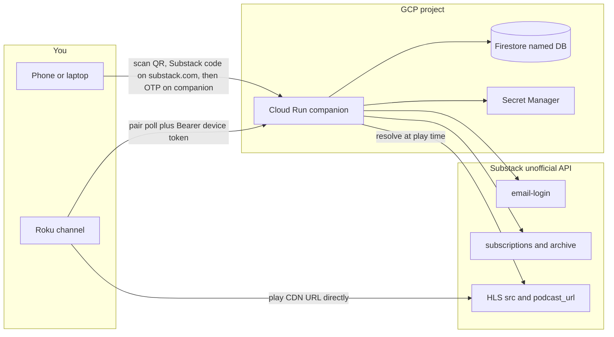

# Roku Substack

A personal, sideloaded Roku channel for browsing your Substack subscriptions and playing native video (HLS) and audio (MP3). A GCP companion API holds your Substack session; the TV only stores an opaque device token.

Substack has no official reader API and no Roku app. This project talks to undocumented session-cookie endpoints **on your behalf**. It is for **personal, low-volume use**. Do not publish it to the Channel Store. Substack’s terms prohibit scraping; keep request rates low.

## Architecture



### End-to-end flow

1. **Sign in** — Open the Roku channel, scan the QR with your phone, then request a Substack login code on [substack.com/sign-in](https://substack.com/sign-in) and enter it on the companion (or paste `substack.sid` if that fails).
2. **Link Roku** — Scanning the QR auto-claims the TV. You can still type the 6-character code on `/link`.
3. **Browse** — Home rows: Recent video, Recent audio, Your subscriptions. Open an author for their posts.
4. **Play** — Companion resolves a fresh HLS or MP3 URL; the Roku player hits the CDN directly.

## Design components

| Component | Role |
| --- | --- |
| **Roku channel** (`channel/`) | SceneGraph app: pairing, `RowList` home, author grid, video/audio players. Talks only to your companion API (`apiBaseUrl`). |
| **Companion API** (`backend/`) | Express/TypeScript: Substack login, device pairing, home JSON, play URL resolution. |
| **Firestore** | Named database `roku-substack`: users (encrypted cookies), pairings, devices, short-lived catalog cache. |
| **Secret Manager** | Session signing key and cookie encryption key (injected into Cloud Run). |
| **Cloud Run + Artifact Registry** | Hosts the API container; Terraform under `infra/` provisions the GCP footing. |

### Why a companion backend?

Roku packages are extractable. A Substack session cookie is full-account access. The companion:

- Holds encrypted `connect.sid` / `substack.sid` in Firestore
- Exposes pairing + catalog APIs for the TV
- Resolves media URLs at play time so signed CDN URLs are not cached

### Security model (high level)

- Browser sessions are cookie-signed; Roku devices use opaque **device tokens** after pairing
- Substack cookies never leave the companion
- Cloud Run can be publicly reachable; authorization is application-level (session or device token)

## Repository layout

```text
channel/   Roku SceneGraph channel (sideload)
backend/   Companion API (Node / TypeScript / Express)
infra/     Terraform (APIs, Cloud Run, Firestore, secrets, IAM, Artifact Registry)
Makefile   Common tasks: test, deploy, sideload
```

## Roku remote controls

| Remote | Action |
| --- | --- |
| D-pad | Move on home rows / author grid |
| OK | Play a post, or open an author |
| Back | Leave player or author grid |
| * (Options) | Clear pairing and start over |

## Getting started

### Prerequisites

- A Google Cloud project with billing enabled (this repo defaults to `roku-502821`)
- [gcloud](https://cloud.google.com/sdk) CLI and Terraform `>= 1.5`
- A Roku in [developer mode](https://developer.roku.com/docs/developer-program/getting-started/developer-account.md) (for sideload)

### Deploy infrastructure and API

See [infra/README.md](infra/README.md) for Terraform apply and secret seeding.

```bash
# After infra is up and backend/.env is filled from .env.example:
make test
make deploy          # build/push image + terraform apply container_image
# or: make release   # test then deploy
```

Set the channel’s `apiBaseUrl` (in `channel/components/MainScene.xml`) to your Cloud Run HTTPS URL, then:

```bash
# backend/.env: ROKU_IP, ROKU_PASS (developer-mode password)
make sideload
```

### Local backend development

```bash
cd backend
cp .env.example .env
gcloud auth application-default login
npm install && npm run dev
```

Point `apiBaseUrl` at your LAN IP (API must listen on `0.0.0.0`) if the TV should hit your laptop.

More detail: [backend/README.md](backend/README.md), [channel/README.md](channel/README.md).

### Make targets

| Target | What it does |
| --- | --- |
| `make test` | Backend unit tests **with coverage**; fails below 80% lines |
| `make test-coverage` | Tests + HTML/lcov under `backend/coverage/` |
| `make deploy` | Docker build/push + Cloud Run via Terraform |
| `make release` | `test` then `deploy` |
| `make package` | Build `channel/roku-substack.zip` |
| `make sideload` | Package and install on the Roku |

Config for deploy/sideload is read from `backend/.env` (`GCP_PROJECT_ID`, `GCP_REGION`, `PUBLIC_BASE_URL`, `ROKU_IP`, `ROKU_PASS`, …).

## License

MIT — see [LICENSE](LICENSE).
